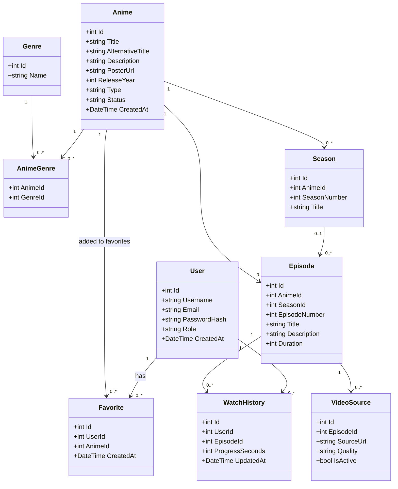

## UML Class Diagram

```mermaid
classDiagram
    direction TB

    class User {
        +int Id
        +string Username
        +string Email
        +string PasswordHash
        +string Role
        +DateTime CreatedAt
    }

    class Anime {
        +int Id
        +string Title
        +string AlternativeTitle
        +string Description
        +string PosterUrl
        +int ReleaseYear
        +string Type
        +string Status
        +DateTime CreatedAt
    }

    class Genre {
        +int Id
        +string Name
    }

    class AnimeGenre {
        +int AnimeId
        +int GenreId
    }

    class Season {
        +int Id
        +int AnimeId
        +int SeasonNumber
        +string Title
    }

    class Episode {
        +int Id
        +int AnimeId
        +int SeasonId
        +int EpisodeNumber
        +string Title
        +string Description
        +int Duration
    }

    class VideoSource {
        +int Id
        +int EpisodeId
        +string SourceUrl
        +string Quality
        +bool IsActive
    }

    class Favorite {
        +int Id
        +int UserId
        +int AnimeId
        +DateTime CreatedAt
    }

    class WatchHistory {
        +int Id
        +int UserId
        +int EpisodeId
        +int ProgressSeconds
        +DateTime UpdatedAt
    }

    User "1" --> "0..*" Favorite : has
    Anime "1" --> "0..*" Favorite : added to favorites

    Anime "1" --> "0..*" AnimeGenre
    Genre "1" --> "0..*" AnimeGenre

    Anime "1" --> "0..*" Season
    Season "0..1" --> "0..*" Episode
    Anime "1" --> "0..*" Episode

    Episode "1" --> "0..*" VideoSource

    User "1" --> "0..*" WatchHistory
    Episode "1" --> "0..*" WatchHistory
```
